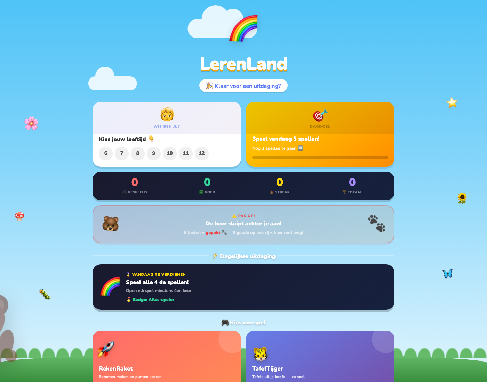
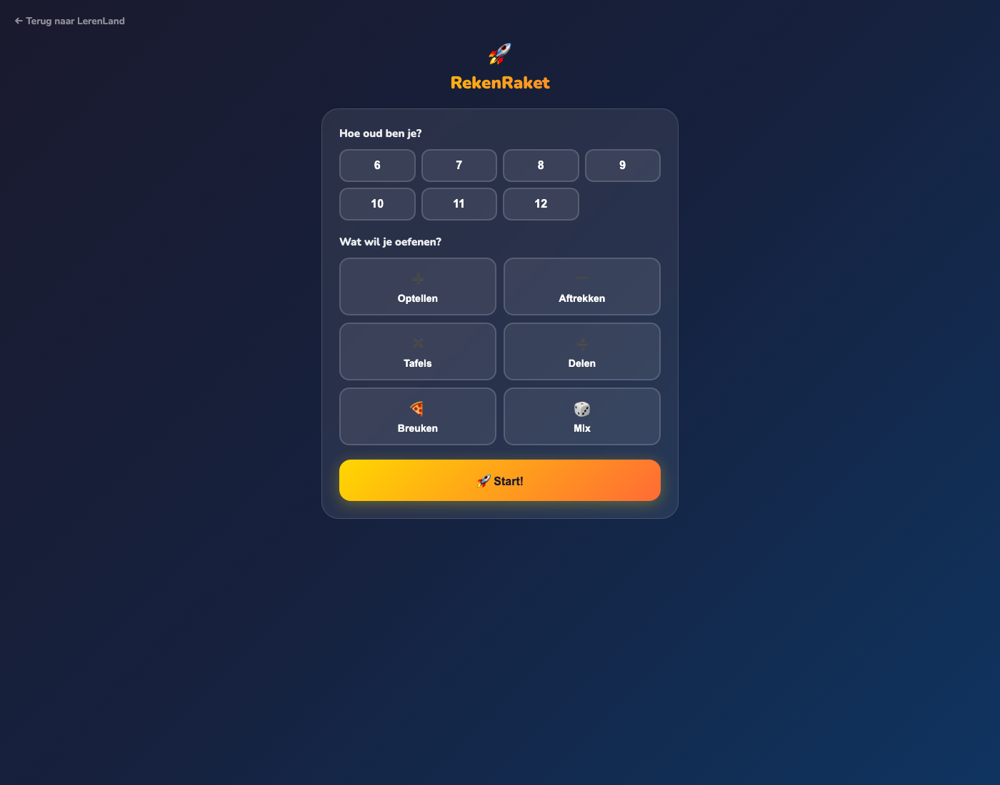
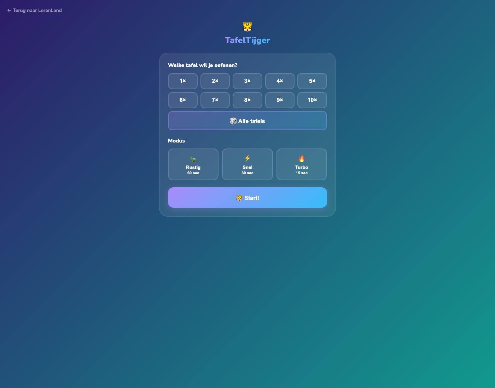
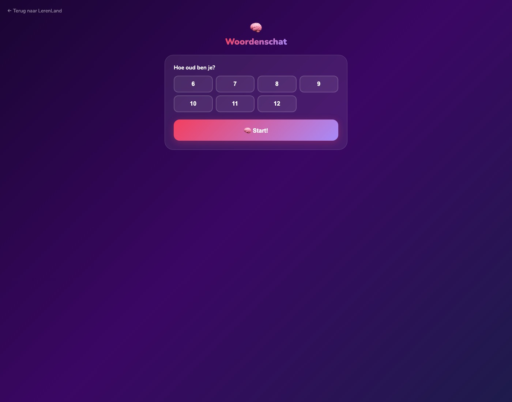
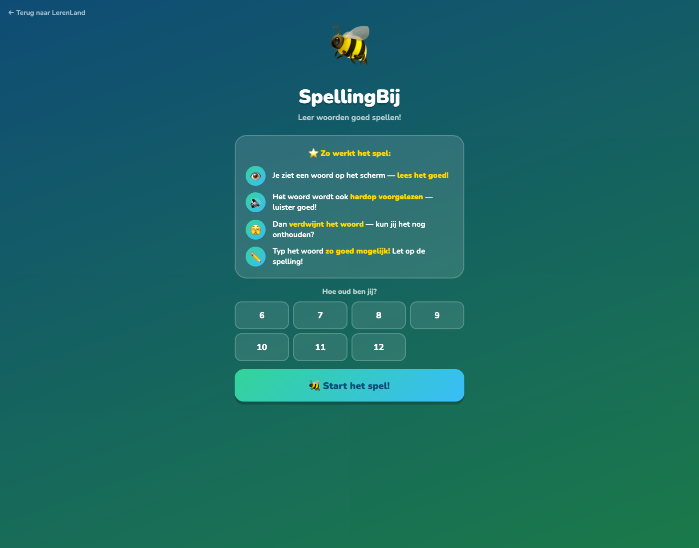

# LerenLand

Educational web app for Dutch primary school kids. Five learning games built around core curriculum topics, with per-child progress tracking so parents and teachers can see what is working.

Runs on `localhost:5002` as a Flask app.

## Stack
- Python 3
- Flask
- SQLite
- HTML, CSS, vanilla JS

## Features
- Five learning games across different subjects
- Per-child accounts with persistent progress
- SQLite database for scores, attempts, and time on task
- Built for low friction use on school laptops and home tablets

## Screenshots

Home with game selection:



RekenRaket (math game):



TafelTijger (multiplication tables):



WoordenWolk (vocabulary):



SpellingsSafari (spelling):



## Status
Private during development. May open source the framework once the first cohort of kids has tested it.

## Local development
```bash
git clone <this-repo>
cd lerenland
pip install -r requirements.txt
flask run --port 5002
```
